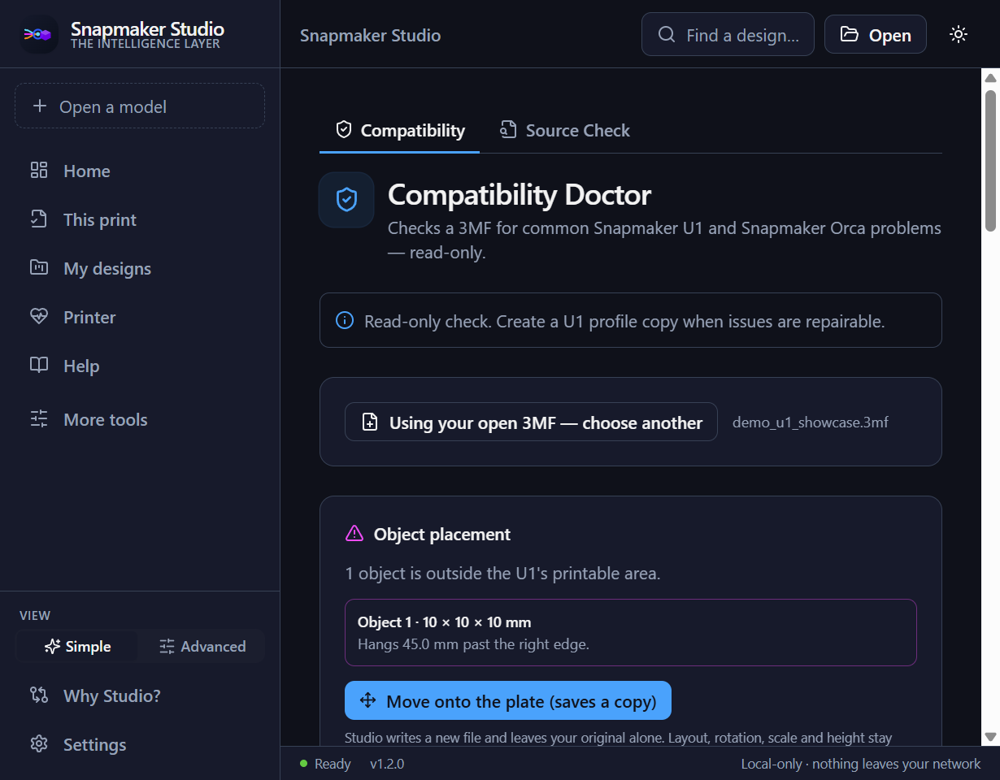
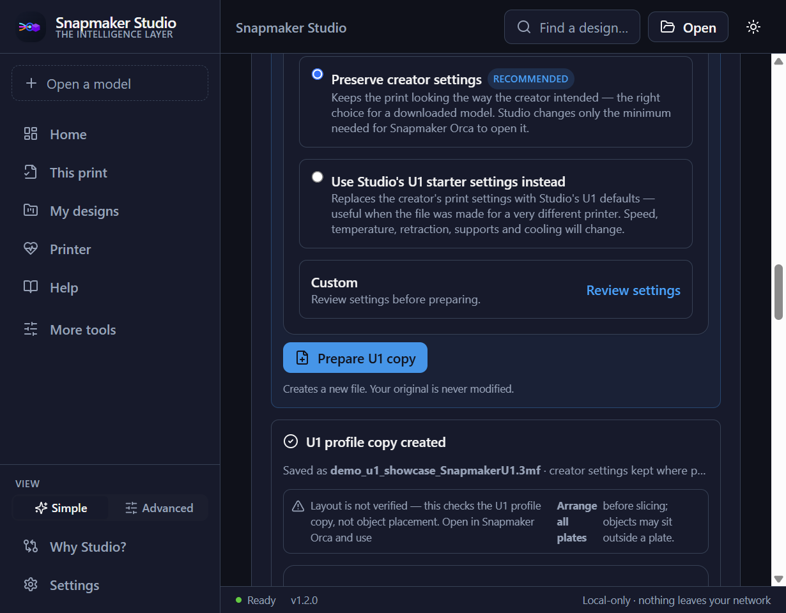
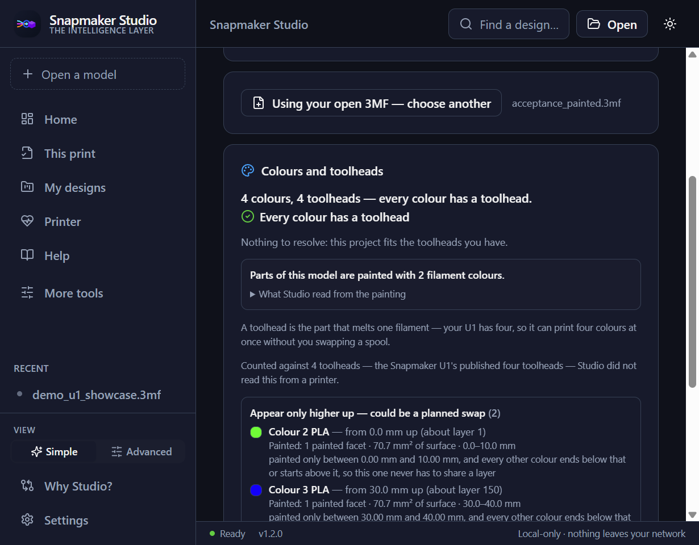
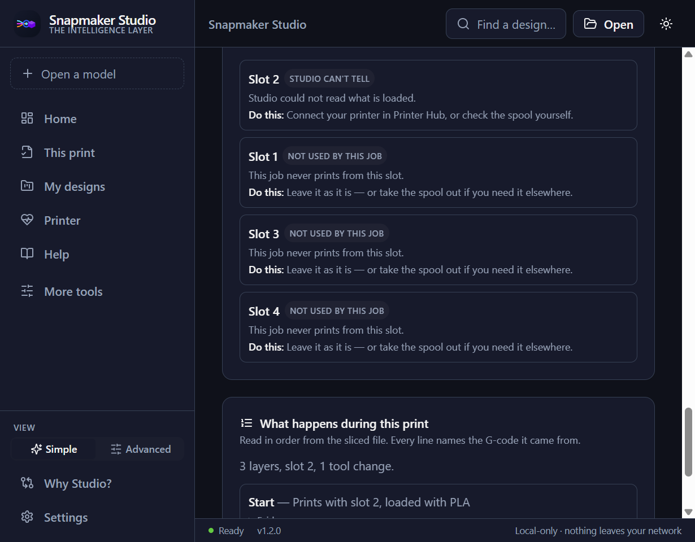

<p align="center"></p>

# Snapmaker Studio


[](https://github.com/DVOpenLabs/snapmaker-studio/actions/workflows/ci.yml)


### You downloaded a model. Will it actually print on your U1?

**Snapmaker Studio checks it against your real printer before you slice — tells you
what is likely to go wrong, fixes what it can prove, and shows you exactly what
changed. Snapmaker Orca still does the slicing.**

Free, open source, and local. No account, no cloud, nothing uploaded off your
local network. Your original file is never modified.

### [▶ Watch it work — 66 seconds](https://github.com/DVOpenLabs/snapmaker-studio/blob/main/docs/media/snapmaker-studio-demo.mp4) · [⬇ Download for Windows or Linux](https://github.com/DVOpenLabs/snapmaker-studio/releases/tag/v1.2.0) · [What it is, in 5 minutes](docs/innovation-fund/JUDGE_OVERVIEW.md)

[](https://github.com/DVOpenLabs/snapmaker-studio/blob/main/docs/media/snapmaker-studio-demo.mp4)

*The Intelligence Layer for Open 3D Printing.*

> **Independent open-source project — not affiliated with or endorsed by Snapmaker.** "Snapmaker" is a trademark of its respective owner.

<sub>Entered in the Snapmaker U1 Innovation Fund, Phase 1 — one of 41 projects in the running. Entry submitted 24 June 2026; being listed is not an endorsement. What the entry says, and how the project has moved since: [docs/innovation-fund/SUBMITTED_ENTRY.md](docs/innovation-fund/SUBMITTED_ENTRY.md).</sub>

## In 30 seconds

**What is it?** A local desktop app that reads a 3D project file and finds
problems that stop prints — before you slice it.

**What problem does it solve?** You download a project and your slicer says
`out of bounds`. Studio says *which object, which edge, how many millimetres,
why* — then moves it in a new copy and lists exactly what survived.

**Why isn't it another slicer?** It doesn't slice and won't. Snapmaker Orca
slices; Studio is the step on either side of it — the checks before, and the
check of what came out.

**What does it actually do?** Reads a project's real contents; compares it against
the printer it can see on your network; corrects only what it can justify;
accounts for every element of what it changed; names the community tool that fits
your file — and once Orca has sliced it, reads the G-code back and checks what
the printer will actually execute against the printer as it is right now.

**Why does Snapmaker's openness make this possible?** The U1 runs Klipper and
Moonraker and publishes what it can do — so Studio can ask the machine itself
rather than guessing from a model name.

**And when it can't know something, it says so.** Studio reads the fitted nozzle
live from the printer; when it cannot get that reading — no printer connected,
or firmware that does not answer — it says *"check this yourself"*, never
*"unsupported"*.

## About the demo

Recorded from the installed application — no slides, no reconstruction. An
out-of-bounds object found and moved, a copy prepared, every change accounted for,
and six colours planned against four toolheads. No printer is connected in the
recording, so it also shows what Studio says when it cannot reach one:
*"Studio can't tell"*, and what to do about it.

## Download

**Windows 10/11 (x64)** ✅ · **Linux x86_64 (.deb)** ✅ · **macOS** not supported.

**[⬇ Download for Windows](https://github.com/DVOpenLabs/snapmaker-studio/releases/tag/v1.2.0)**
— one click, no Python, runs offline.
**[⬇ Download for Linux](https://github.com/DVOpenLabs/snapmaker-studio/releases/tag/v1.2.0)**
— one `.deb`, no Python, no Node, no Rust. Install guide:
[docs/linux-install.md](docs/linux-install.md).

**v1.2.0 is the current stable release** — not a prerelease, so this is also what
GitHub's [latest release](https://github.com/DVOpenLabs/snapmaker-studio/releases/latest)
points at. Every build ever published is on the
[Releases page](https://github.com/DVOpenLabs/snapmaker-studio/releases).

Verify it before you run it:

- Release: [v1.2.0](https://github.com/DVOpenLabs/snapmaker-studio/releases/tag/v1.2.0)
- Windows installer: `Snapmaker.Studio_1.2.0_x64-setup.exe`
  — 18,187,076 bytes — SHA256: `af88020e8a928354638a2e6b67206db288efd39299710482f8b23862d83b9485`
- Linux package: `snapmaker-studio_1.2.0_amd64_25193d05f979.deb`
  — 20,775,352 bytes — SHA256: `e0368006e6e38fbbd6b4e05b4258a37828e7d90f7379f60df17a1c99ce47a216`

```powershell
Get-FileHash -Algorithm SHA256 .\Snapmaker.Studio_1.2.0_x64-setup.exe
```
```bash
sha256sum snapmaker-studio_1.2.0_amd64_25193d05f979.deb
```

Neither installer is code-signed yet, so Windows SmartScreen will show "Unknown
publisher" until it builds reputation — verify the hash above, then choose
**More info → Run anyway**. Why it is unsigned, and what is being done about it:
[docs/CODE_SIGNING_POLICY.md](docs/CODE_SIGNING_POLICY.md). Full instructions and
uninstall: [docs/windows-install.md](docs/windows-install.md) (Windows),
[docs/linux-install.md](docs/linux-install.md) (Linux).

Canonical release values live in
[docs/RELEASE_METADATA.md](docs/RELEASE_METADATA.md); what was verified, and how,
is in [docs/TRUST_STATUS.md](docs/TRUST_STATUS.md).

## Studio got something wrong? That is the report we want

Studio's whole claim is that it tells you the truth about your file and your
printer, and says *"I can't tell"* when it cannot. Every time it gets that wrong,
the claim is weaker — so a wrong analysis is the most useful thing you can send.

**[→ Tell us what it got wrong](https://github.com/DVOpenLabs/snapmaker-studio/issues/new?template=studio-got-this-wrong.yml)**
— two questions: what Studio said, and what was actually true. Or start a
[discussion](https://github.com/DVOpenLabs/snapmaker-studio/discussions) if
you would rather just mention it.

## Screenshots

The desktop app — local-first, dark-first. The whole workflow in one place:
**Understand → check against your printer → prepare → hand to Orca → read the
sliced job back**.

| The problem, named exactly | The fix, in a new copy — and where Studio says it can't tell |
|---|---|
|  |  |
| **Painted colour, read before slicing** | **What to load — and where Studio says it cannot tell** |
|  |  |

From the v1.2.0 build's own installed-application run: the problem and prepared views on the sample project in [`examples/demo_u1_showcase.3mf`](examples/demo_u1_showcase.3mf); the painted view on the acceptance harness's dedicated multi-colour fixture; the what-to-load view on a sliced-job fixture the harness supplies to exercise that screen. Reproduce them with [docs/innovation-fund/JUDGE_WALKTHROUGH.md](docs/innovation-fund/JUDGE_WALKTHROUGH.md). Submission package: [docs/innovation-fund/FINAL_SUBMISSION.md](docs/innovation-fund/FINAL_SUBMISSION.md).

## Why this isn't a slicer, a dashboard, or a converter

**Not a slicer.** It doesn't slice, and won't. Snapmaker Orca slices; Studio is
the step on either side of it. When Orca says `out of bounds`, Studio says *which object,
which edge, how many millimetres, and why* — then offers to move it in a new copy.

**Not a dashboard.** U1Hub, OctoPrint and Fluidd start when a file is ready to
print. Fluidd already ships on your U1 and Studio does not try to replace it.
Printer Hub answers a different question: *is this printer ready for this
specific project?*

**Not a converter.** A converter tells you one word: converted. Studio tells you
what stayed byte-for-byte identical, what it changed and why, what it could not
carry over, and — kept separate on purpose — what it could not check at all. It
only says nothing was lost when the audit proves that for your file.

## Built on the open ecosystem, and pointing at it

Studio reads your project and names the community tool that fits it — OrcaSlicer,
Snapmaker Orca, U1Hub, Fluidd, the toolkits people actually use — so a beginner
does not have to know the whole ecosystem before they can use any of it. The
registry is a data file: adding a tool is a small pull request, not a code change.
See [docs/EXTENDING.md](docs/EXTENDING.md) and
[docs/innovation-fund/OPEN_ECOSYSTEM.md](docs/innovation-fund/OPEN_ECOSYSTEM.md).

MIT licensed. Local-first: no cloud, no account, no telemetry, nothing uploaded
off your local network.
Every third-party project Studio recommends or interoperates with is listed with
its licence in [THIRD_PARTY_NOTICES.md](THIRD_PARTY_NOTICES.md).

## Evidence

Everything below was verified against the published v1.2.0 installer, not
against a development build. Commands, counts and full reports:
[docs/TRUST_STATUS.md](docs/TRUST_STATUS.md).

| What | Result |
|---|---|
| Installed-application acceptance, driven through the real UI | **41/41** |
| Read-only checks against a real Snapmaker U1, from the Windows-installed app | **58/58** |
| Linux clean-image validation, Ubuntu 22.04 + 24.04 | **49/49** each |
| Regression tests against genuine OrcaSlicer / BambuStudio / PrusaSlicer projects | **36 tests** |
| End-to-end pipeline self-check (`u1convert selfcheck`) | **27/27** |
| Backend / desktop / TypeScript / Rust | 2082 · 531 · clean · clean |

The installed-application acceptance count (41/41) is a different total from
v1.1.0's 34/34 because this release adds 7 checks for the two new screens —
see [docs/TRUST_STATUS.md](docs/TRUST_STATUS.md) for exactly which. An
earlier candidate build of this release scored lower on this same harness: a
race in the harness's own test code asserted against the spool-notes table
before it had actually redrawn after "Remove all" — a defect in the test, not
the product. Fixed and reverified 41/41 on a rebuilt installer before this
release shipped.

The real-U1 verification for this release ran read-only through the
Windows-installed application itself: all four toolheads' fitted nozzles read
live and shown as the printer's own reading, an offline-saved conflicting
nozzle note shown as a conflict once the printer answered again with
the printer's value used, and a real "Remove my note" action restoring the
live row — but the Spoolman/Bambuddy-seeded provider-on-hardware checks were
not re-run, this printer's four toolheads all carry the same 0.4 mm nozzle,
and the Linux-installed app was not run against the real printer. Full
detail: [docs/TRUST_STATUS.md](docs/TRUST_STATUS.md).

Reproduce any of it yourself:
[docs/innovation-fund/JUDGE_WALKTHROUGH.md](docs/innovation-fund/JUDGE_WALKTHROUGH.md).

Studio is **advisory**. It does not slice, it does not promise a successful print,
and it never controls your printer on its own. An earlier internal corpus of 112
files produced structurally valid U1 profile copies ([PROOF.md](PROOF.md)); that
number measures structure, not print success, and the checks above are the
stronger evidence.

## What's new in v1.2.0

**Your spool notes, in the desktop app.** Settings → the Materials provider
card → **Your spool notes**: record what is loaded in each slot — material,
subtype, colour, vendor, starting and remaining weight — edit it, clear a
field, or remove it. The remaining weight says where it came from: entered by
you, estimated from what you recorded, tracked by your provider, or not
recorded. A slot the printer reports empty stays empty, whatever a note says.

**Nozzle sizes you confirm, per printer and per toolhead.** Settings → the
**Nozzles** card under Printer. When the printer reports its fitted nozzles,
each toolhead shows the printer's own reading — Source: Printer, Reported
live — with nothing to type over it. When it does not, or it is offline, you
can confirm each toolhead yourself, including mixed sizes; a toolhead left as
"Not sure" stays unknown. If a note you saved earlier disagrees with a live
reading, both are shown and Studio uses the printer's value.

Also in this release: two printer addresses that mean the same printer
(different case, a trailing dot, IPv6 forms) are now treated as one, so your
notes follow the printer; a disagreement between your material provider and
your own note now names the real source instead of attributing it to the
printer; and Save / Remove all are hidden in both new cards when there is
nothing to save or remove.

Windows install identity is unchanged, so v1.2.0 installs over v1.1.0 in
place — verified by a default-path upgrade test from the previous release's
installer (one registration, new version, same location, clean uninstall).

### And what v1.1.0 brought

**Snapmaker Orca is now found automatically on Linux too** — the Known
Limitation from v1.0.0 is closed. Studio reads `.desktop` files correctly
and no longer confuses a similarly-named tool for the one you have.

**The fitted nozzle is no longer unknowable.** Stock Snapmaker U1 firmware
does publish it, and Studio now reads it live from the printer and labels
the reading as the printer's. A size comparison lines up toolhead by
toolhead where the data supports it, instead of only checking whether the
same sizes exist somewhere. The engine can also take a nozzle size you
confirm yourself when firmware does not answer, and labels that as yours —
the desktop app has no screen for entering it yet.

**An optional daily update check**, off by default, using the same
no-telemetry request the manual button already made.

**Groundwork for local spool tracking with no Spoolman or Bambuddy** — the
engine can now keep your own notes on a spool (material, colour, vendor,
remaining weight) and treats them with the same trust rules as a network
provider: a printer that has physically confirmed a slot is empty can never
be overridden by a stale note. The desktop app has no screen for entering
those notes yet; that is next on the [roadmap](docs/ROADMAP.md).

**A read-only community hardware-verification command**
(`u1convert verify-printer`) for anyone to attach to a GitHub issue.

Windows install identity is unchanged, so v1.1.0 installs over v1.0.0 in
place and keeps your data — verified the same way as every prior release.

### And what v1.0.0 brought

**Snapmaker Studio now runs on Linux**, as a self-contained `.deb` for Ubuntu
22.04/24.04 x86_64 — no Python, no Node, no Rust to install. Verified
installing on genuinely clean containers, launching the real app under a real
display, and closing its real window. Guide: [docs/linux-install.md](docs/linux-install.md).

**Closing the window now actually quits Studio and its engine, on both
platforms.** Since beta.13, closing the main window on Windows silently left
the process and its sidecar running in the background — confirmed against a
real built release binary. Every "zero orphan" proof before this one only
covered a process being killed outright, never a normal window close.

Windows install identity is unchanged, so v1.0.0 installed over v0.9.0 in
place and kept your data — verified, including that the upgraded
installation reported the new version and nothing was left duplicated.

### And what v0.9.0 brought

**Bring a project from another slicer and it arrives as the project you
made.** Painted colour survives the crossing, an object's parts arrive as
parts on their own filaments, a modifier arrives as a modifier instead of
solid plastic, and a project of several objects crosses in the target's own
layout. Three per-object settings — layer height, infill density and supports
— cross in the target's vocabulary rather than the source's.

Every one of those was established by handing Snapmaker Orca a project,
letting Orca save it back, and reading what Orca wrote, with a control that
discriminates in each case.

**The print settings carried from your project were reaching the file and not
the slicer.** Studio translates five process values so a project sliced at
0.15 mm with four walls does not arrive at 0.2 mm with two. They were written
but never declared, and an undeclared value is replaced by the preset on load.
Declared now.

**A second materials provider.** Settings offers None, Spoolman or Bambuddy on
the same page. Everything after the address box is identical whichever you
choose — the same sufficiency rules, the same warnings, the same refusals.
Both read-only.

Also fixed: a provider address that redirected off your network was followed;
a slot with a stale mapping claimed the printer had looked at it; and eight
values in the U1 template that had never reached a print were removed.

### And what v0.8.0 brought

**Studio can tell you whether a job has enough filament to finish.** A printer
knows which spool is in a slot and nothing about how much is left on it. If you
run Spoolman on your network, Studio now reads it — Settings → Materials
provider, an address, a connection test, and a spool mapped to each slot. Read
only: Studio never creates a spool in your provider and never decrements the
remaining weight it holds.

How hard it leans on a figure depends on the figure. A short, tracked, recent
weight stops a send. A stale one, a weight worked out from a spool's declared
size, and a weight with no date all warn instead. Nothing tracking the spool
stays unknown — which is still the honest answer on a stock setup.

**Printer intelligence is no longer written around one machine.** The bed and
toolhead fallbacks were constants named after the U1, and a sliced job was checked
against the text "u1" rather than against the printer on the other end of the
wire. That knowledge is now data, and to prove it a second profile ships — a
**VORON 2.4 250**: one extruder against the U1's four, a 250 mm cube, no object
exclusion, and nothing reporting loaded filament, so what is loaded comes back
unknown rather than being invented from a tool count.

**Snapmaker U1 — hardware verified. VORON 2.4 250 — profile verified, hardware
not tested by this project.** No VORON has been connected to Studio. The U1
remains the only printer this project has put on a wire.

### And what came before


**A genuine painted project could be reported as partly undecodable.** v0.7.0
read painting from files Studio's own encoder had written and slicers had echoed
back. This release painted *inside* Snapmaker Orca and Bambu Studio — their
gizmos, their brushes — and read what those slicers saved. That found the defect:
one facet painted with a round brush is written as a 35,460-character attribute,
and Studio refused anything over 4,096, losing that facet's filament, area and
height. It reads them now.

**"Share the same layers" was more than Studio can prove.** Two colours whose
heights overlap *can* meet on a printed layer; whether one does is decided when
Orca slices. The plan is unchanged — a toolhead is reserved either way — but the
card now says *not proven separable* rather than claiming a shared layer.

**Four claims on this project's own pages were false**, including the download
button at the top of this README, which pointed at the previous release for an
entire version. The guard that checks public claims read one line at a time, so a
wrapped sentence or a link outside the Download section was invisible to it. It
reads whole blocks now, and each of those four claims is a test against the guard
itself.

### And what v0.7.0 brought

**Studio reads a project's multi-material painting before anything is sliced** —
which filament slots the painting uses, how many facets carry each, how much
surface area each covers, and the height band each occupies on the plate. Colours
are classified from that evidence: one whose height band overlaps another's has a
toolhead reserved, one that never shares a height can be a planned swap, and one
that cannot be compared says why.

Full boundary, cross-slicer support and how each row was proven:
[docs/PAINTED_COLOUR.md](docs/PAINTED_COLOUR.md).

## Works with the open U1 ecosystem

Studio does not replace Snapmaker Orca, FOrcaSlicer, OrcaSlicer ImageMap, U1 Print
Hub, the Snapmaker U1 Toolkit, the MakerWorld converters or Fluidd. It works out
**when they are the right tool for the file in front of you**, which is the part
nobody can do for themselves before they have already learned all of them.

| What Studio read in your file | What it says |
|---|---|
| More than one nozzle diameter | **FOrcaSlicer** — this project already uses mixed nozzle sizes, which is what that fork is built for |
| Image-texture parts | **OrcaSlicer ImageMap** — most slicers throw this data away; that fork can print it |
| Toolpaths already inside the project | **U1 Print Hub** — the next step is a printer, not a slicer |
| Bambu-family settings from a model site, for another printer | **MakerWorld to Snapmaker U1** — converting at download time keeps the creator's profile intact |
| Nothing unusual | **Snapmaker Orca.** Studio says so plainly rather than manufacturing a reason |

Each suggestion shows the reason Studio read from your file, the tool's licence,
and a caution when the project describes itself as experimental. Studio never
installs anything, never launches a tool on its own, and only calls a tool
installed when it found the executable on your computer.

**Maintain one of these tools?** Studio's description of your project is one JSON
object in
[`backend/snapstudio_core/data/ecosystem.json`](backend/snapstudio_core/data/ecosystem.json).
Correcting it — or asking to be removed — is a small pull request; the schema and
the rules are in [docs/EXTENDING.md](docs/EXTENDING.md). None of these projects
has endorsed Studio, and Studio does not claim otherwise.

## Why

Designs from popular slicers and model sites don't always open cleanly on a given
printer — and novices often can't tell *why*, or whether a file will even print.
Snapmaker Studio closes that gap: open any design and get a plain-language read on
what's in it, a readiness check, and a prepared U1 profile copy (review in Orca
before slicing) — with a fidelity report that shows, element by element, what stayed
identical, what Studio changed and why, and what it could not check. The Snapmaker U1
is the first printer target; the workflow is built to grow across ecosystems.

## What's inside

- **Design Health** — real geometry analysis of the actual mesh: **watertight check,
  hole detection, manifold/normals integrity, overhang → supports prediction,
  stability/tip-risk, and bed fit** — each as a badge with what was found, why it
  matters, and what to do. Volume + an honest material *estimate* too. Slice-free,
  cross-ecosystem, in plain language.
- **Project Intelligence** — read-only design data: dimensions, volume, triangle count
  and complexity, detected materials/colors, object and plate counts, and the source
  ecosystem. No guesswork, no fake data.
- **Validation Center** — a readiness check that answers the questions a novice
  actually has: *will it print, what's preserved, what changes, and what's at risk?* —
  now backed by the Design Health geometry checks above.
- **Prepare** — make a U1 profile copy in one click — review in Orca before slicing.
  Originals are never overwritten; every change is recorded.
- **Printer Hub** — discover a networked Snapmaker U1 over its open, LAN-trusted
  interface and watch live status: print state, progress, bed and toolhead
  temperatures, history, health. **Safe control:** pause, resume, cancel, upload
  sliced gcode, and start — start/cancel/emergency-stop each require an explicit
  confirmation. Studio never auto-starts a print and uploads sliced gcode only (it
  does not slice).
- **Design Library** — everything you open is checked, scored, and kept with its full
  history, so you always know what's ready.
- **Engine + CLI** — the same workflow as a pure-Python engine and `u1convert` CLI for
  scripting and automation.

## What makes it different

- **Design-first and novice-friendly.** It explains a design in plain language and
  surfaces likely print risks — before you ever open a slicer.
- **Local-first.** Everything runs on your machine. No cloud, no account, no
  telemetry. The only thing Studio ever sends anywhere is a sliced job to your own
  printer, on your own network, when you press the button and confirm it.
- **Multi-ecosystem.** Bambu, OrcaSlicer, Snapmaker Orca, PrusaSlicer and plain STL
  are all read properly — a PrusaSlicer project's printer, bed, filaments, colours,
  layer heights, supports and per-object assignments are read from its own config,
  not guessed. What a U1 copy cannot keep from it — variable layer height,
  per-object overrides, support styling — is named in the fidelity report rather
  than lost quietly. The engine is source-neutral, so more ecosystems can follow.
- **Preservation, proved per project.** Preparing a copy is followed by a fidelity
  report: what is byte-identical, what changed and why, what was not carried over,
  and what Studio could not verify. Studio only says nothing was lost when that
  audit proves it for *your* file — and a conversion fails outright on any change
  the engine cannot account for.
- **Open printer opportunity.** The U1 runs open, LAN-trusted firmware, which lets Studio
  provide local Printer Hub monitoring and user-confirmed control/send without cloud accounts.

## Compatibility

| Input | Status | Result |
|---|---|---|
| Bambu / Orca / Snapmaker Orca `.3mf` project | ✅ supported | prepared Snapmaker U1 `.3mf` (review in Orca) |
| Sliced `.gcode` | ✅ read | what the printer will actually execute, checked against your printer |
| `.stl` model | ✅ supported | prepared Snapmaker U1 `.3mf` (review in Orca) |
| PrusaSlicer `.3mf` | ✅ supported | printer, bed, filaments, colours, layer heights, supports and per-object assignments read; what cannot be carried over is named |
| `.obj` / `.glb` | 🚧 planned | — |

First printer target: **Snapmaker U1**. Open the result in Snapmaker Orca to slice
and print. More printer targets are planned — see the [roadmap](docs/ROADMAP.md).

## Quick start (30 seconds)

Most people just install the desktop app (above). For scripting, the engine ships a
CLI. Install from source (PyPI package coming later):

```bash
pip install -e backend
```

Then, using the bundled example:

```bash
# Understand any file first — read-only, never modifies it
u1convert doctor examples/sample_cube_U1.3mf

# Prepare a U1 profile copy from a plain STL (review in Orca before slicing)
u1convert repair examples/sample_cube.stl -o my_part_U1.3mf
```

Open the result in **Snapmaker Orca** to slice and print. More samples live in
[`examples/`](examples/).

Everyday commands:

```bash
u1convert repair model.3mf --mode u1 -o model_U1.3mf   # prepare a U1 profile copy
u1convert validate model_U1.3mf                        # check integrity
```

## Will my file print on the U1?

`doctor` is a read-only readiness check — it never modifies your file:

```text
$ u1convert doctor model.3mf

  Verdict : REPAIRABLE
  Score   : 90/100
  Project type            : Bambu/Orca project
  Snapmaker U1 compatible : yes
  Notes        :
    - incompatible slicer value: wall_filament=0

Recommended action: Run `u1convert repair <file> --mode u1` to prepare a U1 profile copy.
Read-only check - no files were modified.
```

Verdicts: **READY** (loads as-is) · **REPAIRABLE** (run `repair`) · **CONVERTIBLE** (an STL — run `repair`) · **HIGH_RISK** (not a usable project). Add `--json` for machine-readable output.

## What changed between two projects?

`diff` is a read-only comparison — handy to see what preparing a file actually changed:

```text
$ u1convert diff original.3mf converted.3mf

  Structure : +2 parts / -0
  Geometry  : unchanged
  Objects 1->1  Plates 1->1  Colors 4->5
  Painting  : 0 -> 0 painted triangles
  Settings  : 37 changed, 0 added, 0 removed
    printer_model: 'Bambu Lab P1S' -> 'Snapmaker U1'
    ... (use --json for the full list)
```

It reports structure, geometry, settings, and counts. Add `--json` for the full machine-readable diff.

## Architecture

Local-first, no network. Layers:

- **Engine** — `snapstudio_core`, pure Python (no net, no UI): detect →
  understand → validate → prepare, preserving geometry/painting/color. A
  source-neutral canonical model is the seam for multi-ecosystem support.
- **Local API** — `snapstudio_api`, a loopback (`127.0.0.1`) JSON server, request-authenticated,
  frozen with PyInstaller into a single sidecar binary (no Python install needed).
- **Desktop app** — Tauri (Rust) + React + TypeScript. Spawns the sidecar as a
  child process (zero orphans on exit) and talks to it over loopback.
- **CLI** — `u1convert` exposes the same engine for scripting/automation.

Workflow everywhere: **Understand → check the printer → prepare → Orca slices → read the job back** —
validation is mandatory and never removed. Full detail in
[`docs/ARCHITECTURE.md`](docs/ARCHITECTURE.md).

## Roadmap

**Shipped (stable, v1.2.0):** the whole loop — read a project, diagnose it,
compare it against the printer, prepare a copy, prove what survived, hand it to
Snapmaker Orca, then read the sliced G-code back and check what the printer will
actually execute against the printer as it is right now, with cost from the
figures the slicer measured. Plus Batch, Design Library, Printer Hub (monitor and
user-confirmed control/send), Spoolman and Bambuddy material providers, your own
spool notes and per-toolhead nozzle confirmation in the desktop app, Snapmaker
Orca detection on Windows and Linux, an opt-in update check, the engine and CLI
(including `u1convert verify-printer`), a one-click Windows installer with the
engine bundled, and a self-contained Linux `.deb`.

**Next:**
- Carry PrusaSlicer per-object extruder assignments through preparation (reading ships today)
- OBJ and GLB input
- More printer targets beyond the U1
- A stable API for third-party integration

See [CHANGELOG.md](CHANGELOG.md) for release history and
[`docs/ROADMAP.md`](docs/ROADMAP.md) for the full plan. Nothing above overstates what
ships today: multi-printer support and full Prusa preservation are roadmap, not done.

## Contributing

Issues and pull requests are welcome — see [CONTRIBUTING.md](CONTRIBUTING.md).

## License

[MIT](LICENSE)
