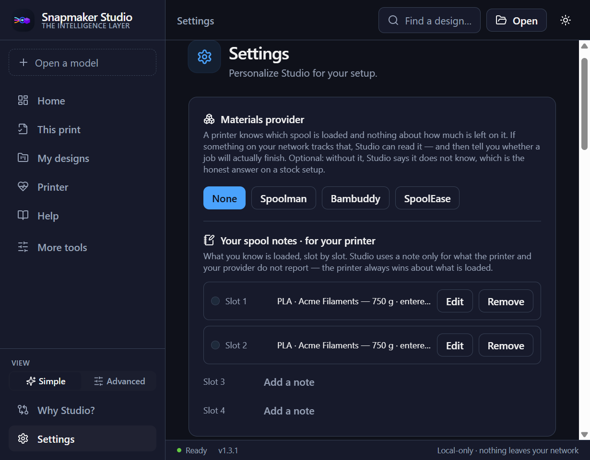
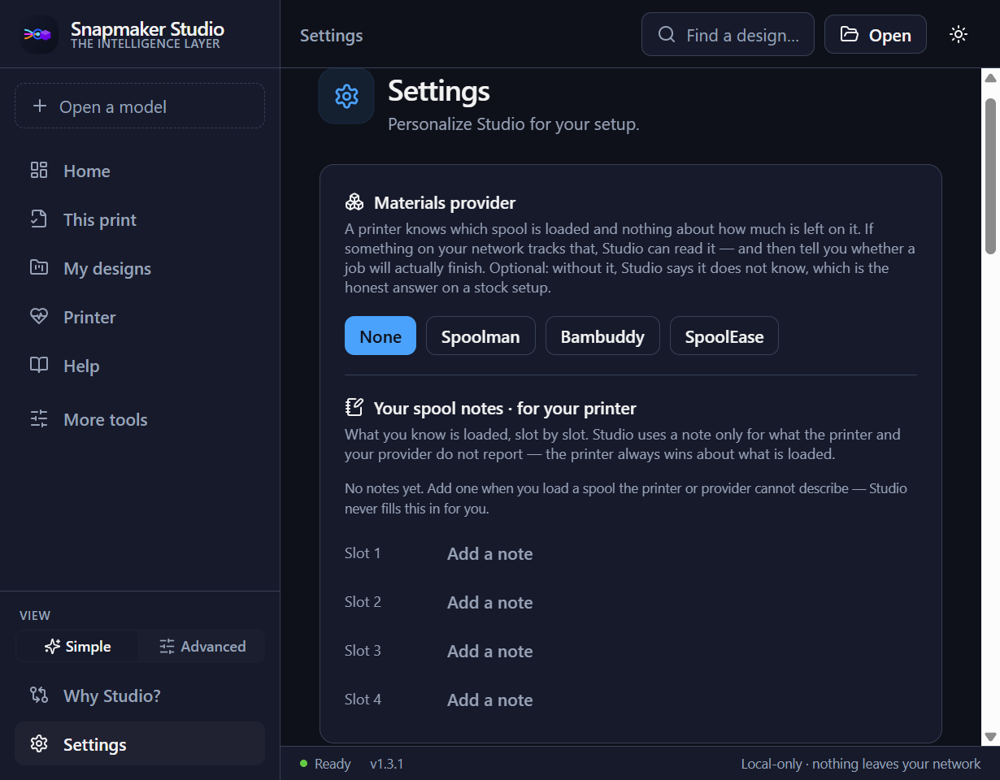

# Do I have enough filament to finish this print?

> **State:** Spoolman, Bambuddy, SpoolEase and the "Your spool notes" screen
> below all ship in the desktop app. SpoolEase support is
> **PROTOCOL VERIFIED against source and fixtures. Initial real-device validation passed; detailed value spot-check pending.** — see
> [interop/SPOOLEASE_PROTOCOL.md](interop/SPOOLEASE_PROTOCOL.md).

A printer knows which spool is in which slot, because it is looking at it. It
knows nothing at all about how much filament is left on that spool. So the
question people actually ask before pressing print is one no printer can answer,
and Studio said "unknown" to it on every setup.

Something on your network may know. **Spoolman** tracks spools and what has been
used from them; **Bambuddy** keeps a spool inventory alongside its printer
management; **SpoolEase** weighs spools on its own scale and keeps the
reading. Studio can read any of the three — read-only, over your own network,
optional.

## Setting it up

**Settings → Materials provider.**

1. Choose **Spoolman**, **Bambuddy** or **SpoolEase**.
2. Type the address of the machine it runs on: `spoolman.local:7912`,
   `bambuddy.local:8000` or SpoolEase's own address (for example
   `192.168.1.50`), or the IP.
3. **SpoolEase only:** enter the security key shown on the SpoolEase screen
   (or set in its own settings). Studio keeps it in memory for this session
   only — you will enter it again after restarting Studio. SpoolEase shows a
   new key each time it restarts unless you set a fixed key in its own
   settings.
4. Press **Test connection**.
5. Say which numbering your slots use — 1 to 4, or 0 to 3 — and then which spool
   is in which slot.

That is all of it. No account, no cloud, and Studio does not scan your network
looking for anything.

Changing provider clears the address and the slot mapping, because a spool id
only means something to the provider that issued it. Carried across, a mapping
would point at whatever spool happened to share the number — and Studio would
then report that spool's material for the slot, confidently and with no reason
to be right.

### If Bambuddy asks Studio to sign in

Bambuddy can be run with authentication switched on, and then it wants an API key
on every request. Studio has nowhere safe to keep one, so it says so rather than
storing a key in the clear. A Bambuddy that does not require a key reads normally.

### SpoolEase: what its weights mean, and why they never block a send

SpoolEase weighs a spool on its own scale, then separately counts what it has
seen a **Bambu** print consume since. It has no way to see anything a
Snapmaker U1 has printed. So every remaining-weight figure Studio works out
from a SpoolEase spool is an estimate — arithmetic Studio performed from a
scale reading and a consumption counter, never a figure SpoolEase itself
calls settled — and every one of them carries this note:

> SpoolEase does not record when this spool was weighed and cannot see what
> your U1 has used since, so treat this as an estimate.

Because of that, a SpoolEase figure can warn that a job may run short, but it
can never be the sole reason Studio refuses to send a job — exactly the same
rule that already applies to a Spoolman or Bambuddy figure that is arithmetic
rather than a tracked measurement, or that carries no date. The full protocol
detail — including how Studio talks to SpoolEase, what it decrypts and how,
and what is and is not bounded by a timeout — is in
[interop/SPOOLEASE_PROTOCOL.md](interop/SPOOLEASE_PROTOCOL.md).

**The security key stays in memory only.** Studio never writes it to its
library database, its settings, a URL, a log, or a diagnostics bundle — only
to the request that needs it, for as long as Studio is running. Restart
Studio and you enter it again.

**Behaviour change for every provider, including Spoolman and Bambuddy.**
Adding SpoolEase changed how Studio decides whether an address is "on your
own network," for every provider, not only for SpoolEase:

- A provider name is now checked by what it actually resolves to, not only by
  how it is spelled. A name that resolves to both a local and a public
  address is read on the local one only; a name that resolves only to a
  public address is refused, with a message asking you to enter the
  provider's own local address instead (for example its `192.168.x.x`
  address).
- Environment- and system-configured proxies are now ignored for a provider
  read — Studio connects to your provider directly, on your own network.
- The address check is by address category (loopback, a private range,
  link-local, a Tailscale-style carrier-grade-NAT address, IPv6 site-local) —
  it is a real check, but it is not literally proof that an address belongs
  to you personally, the same limit every provider address check has always
  had.
- Scoped IPv6 literals (`fe80::1%eth0`, `fe80::1%12`) are handed to the
  operating system exactly as before; nothing new is claimed here. On
  Windows, only the numeric form (`%12`) is known to resolve.

Most working Spoolman or Bambuddy setups see no difference. Two setups will:
a provider address that used to reach the internet through a system or
environment proxy no longer does — Studio now connects to your provider
directly, so a setup that relied on a proxy to resolve or reach the address
will need the provider's own local address entered instead; and a
dual-stack name that used to resolve to both a local and a public address is
now read on the local address only rather than possibly following the
public one, which is a narrowing of behaviour, not a loosening of it.

**Downgrading:** if you go back to a Studio version that predates SpoolEase
support, choose **None** (or another provider) in Settings first — an older
version does not know the `spoolease` provider kind.

### Why it asks about slot numbering

A person counts the slots on a printer 1, 2, 3, 4. G-code counts them 0, 1, 2, 3.
Guess wrong and every spool is one slot out, and Studio then reports the wrong
material for every slot with complete confidence — which is worse than not
knowing. So it asks instead of guessing.

### What "Test connection" tells you

Two numbers, because they are genuinely different:

- how many spools the provider has;
- how many of those carry a weight **something is actually keeping track of**.

Both providers report what a spool started with until something prints from it. A
shelf of spools you have just registered will all report a full kilogram, and that
is a declared size rather than a measurement. Studio treats those as estimates,
and says so, rather than letting a number that has never been updated stop you
printing.

Bambuddy has no remaining-weight field at all: it stores what the label claimed
and what has been used, and Studio subtracts one from the other. That figure is
arithmetic, and Studio never presents it as something Bambuddy is keeping — unless
the spool has been weighed, which writes both the figure and the moment it was
true.

## What Studio will and will not say

| What it knows | What it says |
|---|---|
| A tracked weight, updated recently, and the job needs more | **Not enough** — this blocks the send |
| A tracked weight, updated recently, and enough for the job | Enough, with the figure and its age |
| A tracked weight nobody has updated in over a week | A warning, with how old it is. Never a refusal |
| A weight worked out from the spool's declared size | A warning. It is arithmetic, not a record |
| A weight with no date at all | A warning. Nothing says it is still true |
| Nothing tracking the spool | **Unknown** — go and look at it |
| The provider is unreachable | **Unknown**. Not "enough", and not "empty" |

A blocker is the strongest thing Studio says, so it has to be earned: only a
figure something is genuinely keeping, recent enough to still be true, can stop a
send. Everything else warns. The reason is not caution for its own sake — a
person refused a print over bookkeeping learns to ignore the refusals, and the
next one might be right.

Past a week, a figure warns and can never be the sole reason a send is refused.

## The printer and the provider disagreeing

The printer is authoritative about **what is physically in the slot**, because it
can see it. A provider adds what the machine cannot know: which spool this is, and
how much is on it.

When they disagree, Studio shows the disagreement and keeps the printer's answer:

> Printer reports PLA; your provider mapping says PETG. Check slot 2.

It does not pick a winner quietly, and it does not throw away the provider's
remaining weight because the material disagreed — those are two separate claims
about the same slot, and the second may still be right.

## On a printer that reports no filament at all

Most Klipper printers publish nothing about what is loaded; the Snapmaker U1 is
unusual in doing so. On a machine that does not, your mapping is the only source —
and Studio says so in those words:

> PLA is mapped to this slot and matches what the job expects. This printer does
> not report its own filament, so that is your mapping rather than something the
> machine has confirmed.

A provider mapping is never presented as an observation. Studio will still use
the remaining weight, because a spool you told it about having 43 g on it is a
real reason to expect an 87 g job to run out.

## What Studio never does

- **Writes to a provider.** Studio does not create spools in Spoolman or
  Bambuddy, does not decrement their remaining weight, and does not mark a spool
  used after a print. Consumption tracking belongs to the tool that owns the data;
  two tools writing the same number is how they end up disagreeing.
- **Requires a provider.** A stock printer with no other software is a first-class
  setup. Without a provider, Studio says it does not know, which is true.
- **Leaves your network.** The address is checked to be on your own network —
  loopback, a private range, a tailnet, or a `.local` style name — before any
  request is opened. A public address is refused rather than fetched, and so is a
  local address that answers with a redirect to a public one.
- **Invents a figure.** A provider that cannot say how much is left produces
  unknown, everywhere, all the way to the send button.

## Your spool notes

Since v1.1.0 the engine has kept your own notes on a spool — material,
colour, vendor, starting and remaining weight — stored in Studio's local library
on your machine, one note per printer slot. They pass through the same rules as
a provider:

- A figure you typed is labelled as yours. A figure Studio worked out by
  subtracting a job's usage from it is labelled differently, and the two never
  look the same.
- The printer stays authoritative about what is physically in the slot. A slot
  the printer reports empty can never be overridden by a note.
- Studio subtracts from a note's remaining weight only when explicitly asked to
  record a job's usage — never while reading, planning or sending a job.

In the desktop app: Settings → **Materials provider** card →
**Your spool notes**.
Each slot shows its note, or "Add a note". A weight you type reads "entered by
you"; after **Record filament used** — which asks you to confirm the grams first —
it reads "estimated from what you recorded". Changing the material, subtype,
colour or vendor to a different spool resets the weight to "no weight recorded";
clearing a field does not. Switching between None, Spoolman and Bambuddy never
touches your notes. If two notes exist for one slot (the same printer saved
under two spellings of its address), neither is used and the slot shows
a message such as "Two notes exist for slot 1 — remove one" until you remove one.

## Other providers

Material providers normalise into a shared read-only contract; **Spoolman,
Bambuddy and SpoolEase are currently implemented**. Three is not "any
provider works" — they are providers whose wire formats have almost nothing
in common with each other, proved to produce the same decisions from the
same facts. `material_providers.py` is the only place a provider's name is
turned into anything; past it the name is a label on a fact.

One difference is not yet unified: an address problem is reported the same
way, `invalid_address`, on every provider, but every other SpoolEase failure
carries its own specific reason while Spoolman and Bambuddy currently report
only a general "did not answer" for their own network failures. Giving
Spoolman and Bambuddy the same granularity SpoolEase has is recorded as
follow-up work — no behaviour changes because of it today.

**L-6 (Sol r3, #39):** the `invalid_address` unification above was true of the
*text* of the message but not of `error_code` — Spoolman's and Bambuddy's own
readers set `error` on an address refusal (including an off-network redirect)
without ever setting `error_code` to `"invalid_address"`, so
`service._with_providers`'s host-free substitution (keyed on that code) never
ran for them, and a Spoolman/Bambuddy address that resolves only publicly, or
a redirect off-network, could put the configured host straight into
`provider_status.error`. Fixed: both readers now set `error_code` on every
`InvalidProviderAddress` they catch, exactly as SpoolEase already did.
`_with_providers` also now re-checks the resulting error text against the
configured host as a backstop, whichever error code produced it — defence in
depth, not a reason to skip fixing the readers themselves.

**U1Hub** was re-examined on 2026-08-25 and is deliberately **not** integrated. It
does expose `/api/spools` and `/api/slots`, but they carry no version or schema,
are undocumented for use by other tools, sit behind its own password gate, and are
written for its own interface — and, decisively, U1Hub tracks spool *identity*
(brand, material, colour) and not remaining weight, so it has nothing to answer
this question with. Studio has never read its internal files and will not.
See [interop/U1HUB_INTEROP_PROPOSAL.md](interop/U1HUB_INTEROP_PROPOSAL.md).
